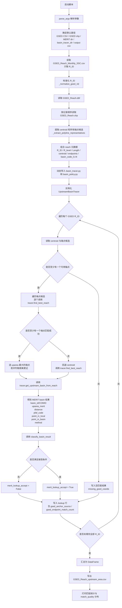

# `build_gsed_merit_area_lookup.py` Flowchart

这个脚本的目标是：

1. 读取 GSED 的 `R_ID`
2. 从 `GSED_Reach.shp/.dbf` 恢复每条 reach 的 centroid、端点候选和层级信息
3. 先把端点候选匹配到 MERIT reach，并据此推断下游锚点
4. 再从已知 MERIT reach 直接追溯上游 basin，避免重复做第二次 reach 匹配
5. 把匹配到的 `uparea` 写成 `R_ID -> upstream_area_km2` lookup 表
6. 同时输出一组审计字段，供后续筛选和人工检查

## Mermaid

## 接受条件

脚本里当前把一条 MERIT 面积标记为可正式回填的条件定义为：

1. `merit_basin_status == "resolved"`
2. `merit_method == "upstream_traced"`

也就是：

1. 必须通过 `scripts_basin_test` 共享的 basin policy
2. 必须来自真实上游流域追溯结果
3. 不能只是 fallback buffer

## 输出表的关键字段

最终输出的 `GSED_Reach_upstream_area.csv` 里，最关键的是这些列：

1. `R_ID`
2. `upstream_area_km2`
3. `merit_comid`
4. `merit_pfaf_code`
5. `merit_distance_m`
6. `merit_match_quality`
7. `merit_method`
8. `merit_point_in_local`
9. `merit_point_in_basin`
10. `merit_basin_status`
11. `merit_basin_flag`
12. `merit_lookup_accept`
13. `gsed_anchor_source`
14. `gsed_endpoint_match_count`

## 与后续 GSED 主流程的关系

`process_gsed_cf18.py` 现在会自动读取这张 lookup 表，并且优先只使用：

1. `merit_lookup_accept = True`

的记录，把它们写入 GSED 输出 NetCDF 的 `upstream_area`。
